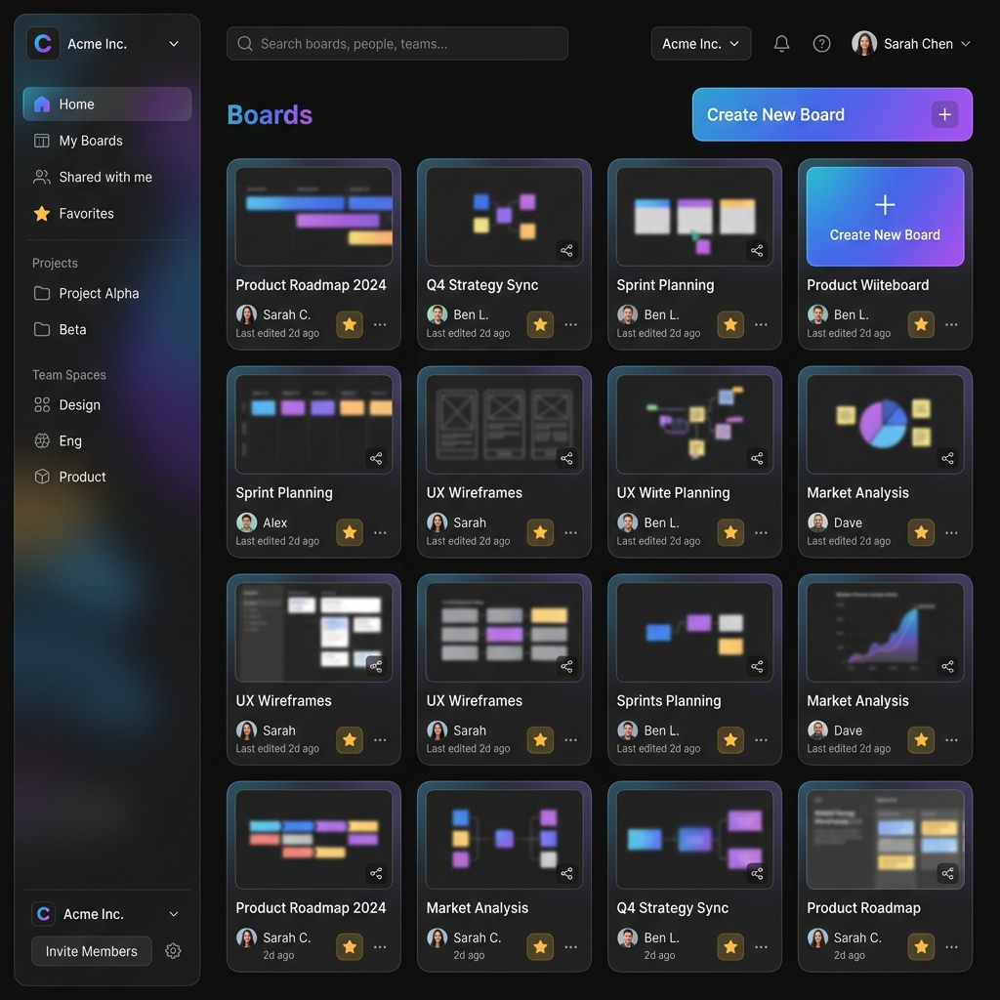
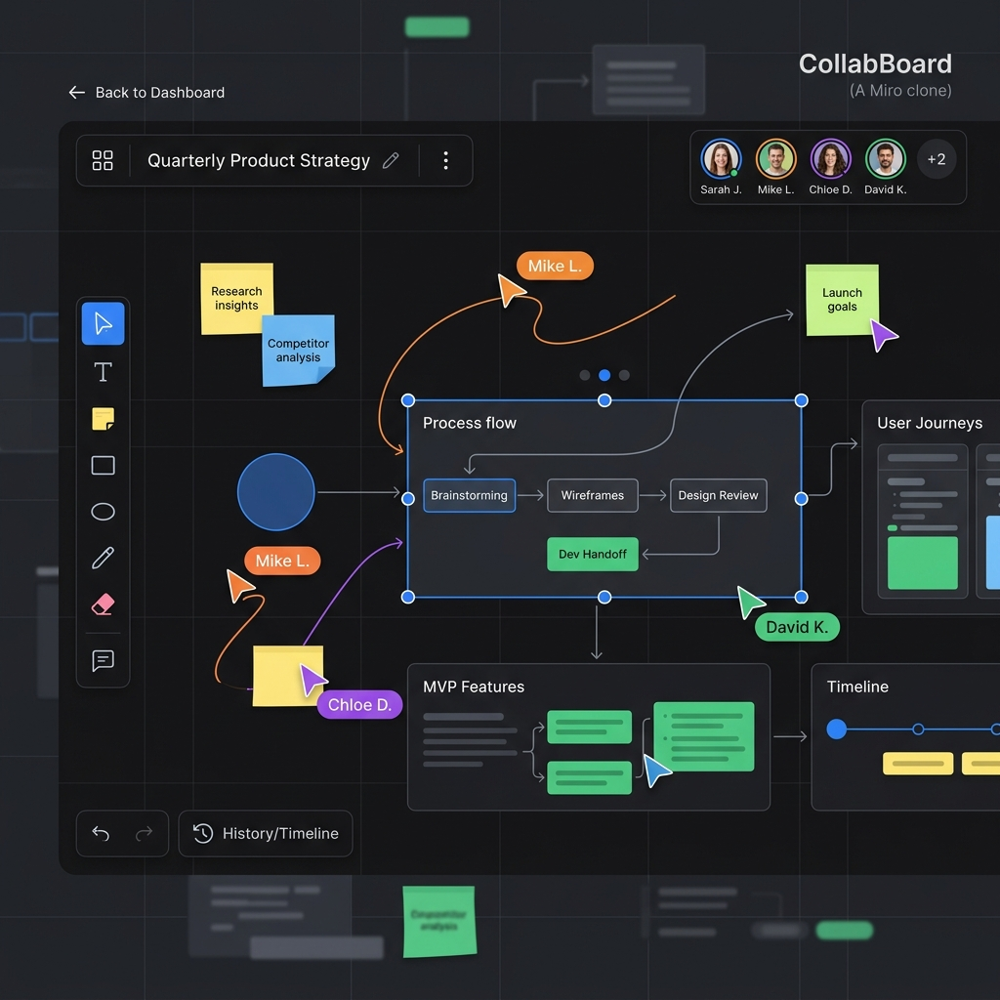

# Collaborative Real-Time Whiteboard (Miro Clone)

A modern, real-time collaborative whiteboard application built with Next.js, React, Tailwind CSS, Convex, Clerk, and Liveblocks. It enables multiple users to collaborate on a digital canvas simultaneously, draw shapes, write text, leave sticky notes, and track other users' cursors in real-time.

---

## 🎨 Snapshots

### 1. Board Dashboard
Below is a mockup of the sleek, modern dashboard page containing the organization switcher, search inputs, and list of boards.


### 2. Collaborative Whiteboard Canvas
Below is a mockup of the real-time collaborative canvas displaying shapes, sticky notes, other players' cursors, and the drawing toolbar.


---

## 🚀 Key Features

- **Multiplayer Collaboration**: Real-time cursor tracking, selection boxes, and drawing paths synced instantly across all connected clients via Liveblocks.
- **Canvas Shapes**: Insert, resize, move, color, and delete elements like Rectangles, Ellipses, Sticky Notes, Text boxes, and Freehand pencil drawings.
- **Multi-select**: Click-and-drag selection net to group and manipulate multiple layers at once.
- **History (Undo/Redo)**: Full multiplayer undo/redo stack supported directly through Liveblocks room storage.
- **Convex Database**: Blazing fast backend database querying and mutations to manage boards, favorites, and metadata.
- **Clerk Authentication**: Seamless login and multi-tenant organization switching.
- **Rename & Actions Modal**: Contextual dropdown menus and popups to rename, duplicate, favorite, or delete boards.

---

## 🛠️ Tech Stack

- **Framework**: [Next.js (App Router)](https://nextjs.org/)
- **Frontend library**: [React](https://react.dev/)
- **Styling**: [Tailwind CSS](https://tailwindcss.com/)
- **Real-Time Database**: [Convex](https://www.convex.dev/)
- **Collaboration Engine**: [Liveblocks](https://liveblocks.io/)
- **Authentication**: [Clerk](https://clerk.com/)
- **State Management**: [Zustand](https://zustand-demo.pmnd.rs/)

---

## ⚙️ Environment Configuration

Create a `.env.local` file in the root of the project with the following keys:

```env
# Convex Deployment Config (Get these from npx convex dev)
CONVEX_DEPLOYMENT=...
NEXT_PUBLIC_CONVEX_URL=...
NEXT_PUBLIC_CONVEX_SITE_URL=...

# Clerk Auth Config
NEXT_PUBLIC_CLERK_PUBLISHABLE_KEY=...
CLERK_SECRET_KEY=...

# Liveblocks Config
# (Provide this key to run client-side public auth)
NEXT_PUBLIC_LIVEBLOCKS_PUBLIC_KEY="pk_dev_..."
# (Optionally provide this key to enable server-side auth route with Clerk profile sync)
LIVEBLOCKS_SECRET_KEY="sk_dev_..."
```

---

## 🏁 Getting Started

### 1. Install Dependencies
```bash
npm install
```

### 2. Start the Convex Backend
Run the Convex development server in a separate terminal:
```bash
npx convex dev
```

### 3. Run the Next.js Dev Server
```bash
npm run dev
```

Open [MIRO app](https://miro-nine.vercel.app/) with your browser to see the result.
